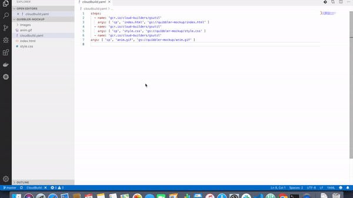

# Google Cloud Platform CloudBuild extension for VSCode

This extension allows you to always have a look of your Cloudbuild job's status 
directly inside Visual Studio Code.

## Features

Track the status of your CloudBuild job for the current branch right after you've 
pushed to it !

## Requirements

For this extension to run, you'll need the `gcloud` command line installed 
locally in your computer, [see here](https://cloud.google.com/sdk/install).

Also, the project of your `gcloud` command must be already setted (with the command
`gcloud config set project [YOUR_PROJECT_ID]`).

## Installation

To install the extension with the latest version of Visual Studio Code :
* open up the Visual Studio Code Command Palette (`F1`)
* type `install` and choose `Extensions: Install Extensions`
* in the Search Extensions in Marketplace text box, type `gcp-cloudbuild`. 
* Find the VSCode GCP CloudBuild extension published by an0rak-dev (Sylvain Nieuwlandt) and click the Install button. 

## Known Issues

If you find an issue or have a feature request, you can contribute it 
[here](https://github.com/an0rak-dev/vscode-gcp-cloudbuild/issues/new)

## Release Notes

* 1.0.0 : Initial Release
    * Display the status of a CloudBuild pipeline for the current branch.
